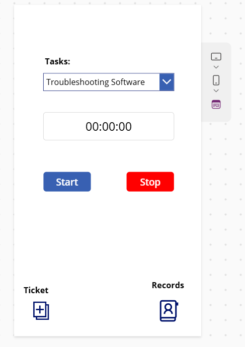
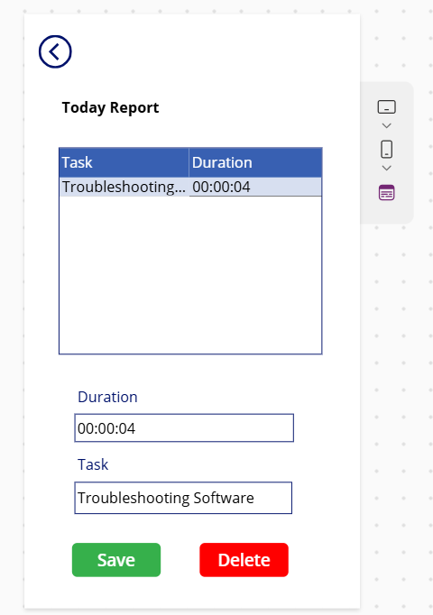
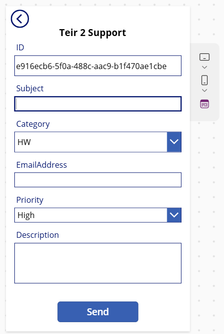
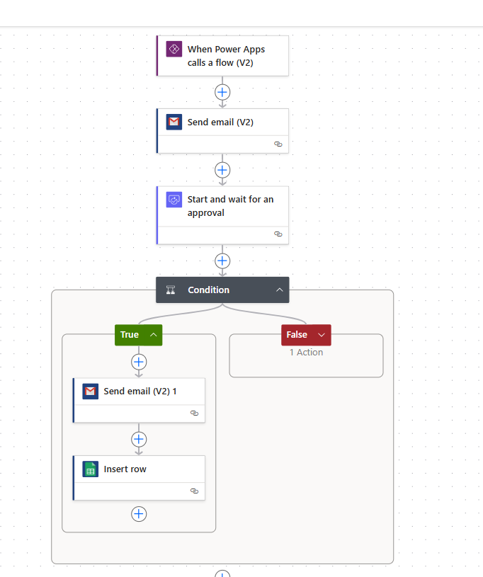
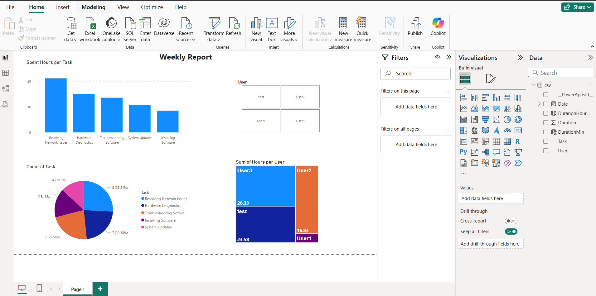

# Power Platform Work Logger & Support Ticket System

   

## Summary

This project is a self-directed exploration and application of the Microsoft Power Platform (Power Apps, Power Automate, Power BI) integrated with Google Sheets. It demonstrates the creation of a practical business solution involving time tracking, data management, reporting, and automated approval workflows for a tiered support scenario.

The core components include:
1.  A **Power App** ('Work Logger') for user interaction: logging work sessions with a timer, managing task records, and submitting support tickets.
2.  **Google Sheets** as the backend data source for storing task logs and potentially ticket information.
3.  A **Power BI** dashboard connected to the Google Sheet to visualize and analyze work patterns, task durations, and user productivity.
4.  A **Power Automate** flow triggered by the Power App to handle the support ticket submission, including an approval process directed specifically at Tier 2 support and subsequent data recording upon approval.

## Features

*   **Work Logging (Power Apps):**
    *   Select task from a predefined list.
    *   Start/Stop timer to record session duration.
    *   View daily logged tasks and durations.
    *   Save and Delete logged entries.
*   **Support Ticket Submission (Power Apps):**
    *   Dedicated form for creating Tier 2 support requests.
    *   Fields for Subject, Category, Email Address, Priority, and Description.
*   **Data Storage (Google Sheets):**
    *   Stores time tracking data (Task, Duration, User, Date).
    *   Potentially stores approved support ticket details.
*   **Workflow Automation (Power Automate):**
    *   Triggered on ticket submission from Power Apps.
    *   Sends initial notification email.
    *   Initiates a formal approval process targeting specific approvers (Tier 2).
    *   Conditional logic based on approval outcome (Approved/Rejected).
    *   Sends confirmation email upon approval.
    *   Saves approved ticket data (e.g., back to Google Sheets or another system).
*   **Data Analysis & Visualization (Power BI):**
    *   Connects directly to Google Sheets data.
    *   Interactive dashboards showcasing:
        *   Total time spent per task.
        *   Distribution of task types.
        *   User-specific productivity metrics (e.g., hours logged).
        *   Filtering capabilities for focused analysis.

## Technology Stack

*   **Frontend & User Interface:** Microsoft Power Apps (Canvas App)
*   **Workflow Automation:** Microsoft Power Automate
*   **Data Visualization & BI:** Microsoft Power BI
*   **Data Storage:** Google Sheets

## Screenshots

### Power App Screens

**1. Task Timer & Logging**
*Description: Screen for selecting a task, starting/stopping the timer, and viewing main navigation.*
 

**2. Daily Report & Record Management**
*Description: Screen displaying tasks logged for the day, allowing users to view details and delete entries.*
 

**3. Tier 2 Support Ticket Form**
*Description: Screen for submitting a support ticket with relevant fields.*
 
### Power Automate Flow

*Description: Overview of the automated workflow triggered by the app for ticket submission, including email, approval, conditional logic, and data insertion steps.*
 
### Power BI Dashboard

*Description: Power BI report visualizing data from Google Sheets, showing task analysis and user productivity metrics.*
 

## Project Purpose & Learning

This project was undertaken as a self-directed initiative to develop and demonstrate practical skills within the Office 365 Power Platform ecosystem. It showcases the ability to:
*   Design and build functional user interfaces with Power Apps.
*   Integrate applications with common data sources like Google Sheets.
*   Automate business processes, including approvals and notifications, using Power Automate.
*   Connect data sources to Power BI and create meaningful dashboards for data-driven insights.
*   Apply these tools cohesively to solve a realistic business scenario involving time tracking and tiered support.
